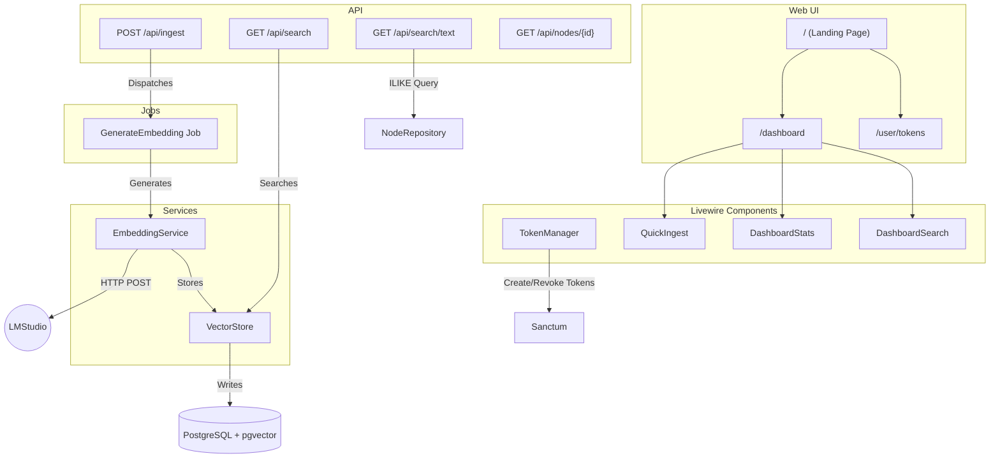

# Personal Knowledge Graph Architecture

## Overview
The Personal Knowledge Graph (PKG) is a Laravel 12 application that stores structured knowledge and vector embeddings in PostgreSQL with the pgvector extension. It generates embeddings via LMStudio's `text-embedding-nomic-embed-text-v2` model (768-dimensional vectors) using direct HTTP calls. The system supports ingestion of documents, semantic similarity search, and a web UI for token management and exploration.

## Technology Stack
- **Backend:** Laravel 12, PHP 8.5
- **Database:** PostgreSQL 18.1 with pgvector extension
- **AI:** LMStudio (local inference), `text-embedding-nomic-embed-text-v2` (768 dims)
- **Frontend:** Blade templates, Livewire, Tailwind CSS, Flux UI
- **Authentication:** Laravel Sanctum + Fortify
- **Queue:** Redis/database driver for async embedding generation

## Database Schema

### Tables
| Table | Columns | Notes |
|-------|---------|-------|
| `nodes` | id (UUID), type, content, metadata (jsonb), created_at, updated_at | Entities, concepts, or text chunks |
| `edges` | id (UUID), source_id (FK), target_id (FK), relation, weight | Graph relationships |
| `embeddings` | node_id (FK, PK), embedding (vector(768)), created_at | 768-dimensional vectors |
| `users` | Standard Laravel users table | Managed by Fortify |
| `personal_access_tokens` | Sanctum tokens | API authentication |

### Indexes
- `idx_nodes_type` on `nodes.type`
- `idx_edges_source_target` composite on edges
- `idx_embeddings_node_id` primary key
- HNSW index on `embeddings.embedding` (cosine distance)

## Architecture Diagram


## Key Classes & Responsibilities

| Class | Location | Responsibility |
|-------|----------|----------------|
| `IngestController` | app/Http/Controllers/Api/ | Parses text, dispatches embedding jobs |
| `SearchController` | app/Http/Controllers/Api/ | Handles semantic similarity search |
| `NodeController` | app/Http/Controllers/Api/ | CRUD operations on nodes |
| `TokenManager` | app/Livewire/User/ | Create, list, revoke API tokens |
| `DashboardSearch` | app/Livewire/ | Search bar with live results |
| `DashboardStats` | app/Livewire/ | Statistics display |
| `QuickIngest` | app/Livewire/ | Quick content ingestion form |
| `GenerateEmbedding` | app/Jobs/ | Queued job for embedding generation |
| `EmbeddingService` | app/Services/ | Direct HTTP calls to LMStudio |
| `VectorStore` | app/Services/ | pgvector similarity queries |

## API Design

### Endpoints
| Method | Endpoint | Body/Query | Response |
|--------|----------|------------|----------|
| POST | `/api/ingest` | `{"text": "...", "tags": [...]}` | `201` with node IDs |
| GET | `/api/search` | `?q=query&limit=10` | Nodes with similarity scores |
| GET | `/api/search/text` | `?q=keyword&limit=10` | Full-text matched nodes |
| GET | `/api/nodes/{id}` | — | Node with edges |
| DELETE | `/api/nodes/{id}` | — | `204` |

### Authentication
- All API endpoints require `Authorization: Bearer <token>` header
- Tokens created via TokenManager UI or `php artisan token:create`
- Sanctum handles token hashing and validation

## Data Flow

### Ingestion
1. User submits text via Dashboard → QuickIngest or API
2. Text chunked into sentences/paragraphs
3. Each chunk creates a `Node` (type: `text_chunk`)
4. `GenerateEmbedding` job dispatched per node
5. Job calls LMStudio, stores vector in `embeddings` table
6. Optional: tag nodes via `tags` parameter

### Semantic Search
1. Query text sent to `/api/search`
2. Query vector generated via LMStudio
3. `VectorStore::searchSimilar()` finds nearest neighbors
4. Results returned with cosine similarity scores (0-1)

## User Interface

### Landing Page (`/`)
- Project description and features
- API documentation with curl examples
- Login/Register buttons

### Dashboard (`/dashboard`) - Authenticated
- **Stats cards:** Total nodes, embeddings, edges
- **Search bar:** Real-time semantic search
- **Quick Ingest:** Add new content
- **Recent Nodes:** Latest additions with embedding status

### Token Management (`/user/tokens`)
- Create named API tokens
- Copy token to clipboard
- Revoke tokens with confirmation

## Testing
- **181 tests passing** (453 assertions)
- Coverage: API endpoints, services, Livewire components, jobs
- Tests use PostgreSQL connection (see `phpunit.xml`)

## Known Issues / Technical Debt
| Issue | Priority | Status |
|-------|----------|--------|
| Copy to clipboard button JS | Low | Minor UI fix needed |
| HNSW index creation automation | Medium | Helper methods exist, not automated |

## Commands
```bash
# Run tests
php artisan test

# Create API token
php artisan tinker --execute="\$user = App\Models\User::first(); echo \$user->createToken('name')->plainTextToken;"

# Run queue worker
php artisan queue:work

# Rebuild HNSW index (manual)
php artisan tinker --execute="\$s = new App\Services\VectorStore; \$s->createHnswIndex('cosine');"
```

## File Structure
```
app/
├── Http/
│   └── Controllers/Api/
│       ├── IngestController.php
│       ├── SearchController.php
│       └── NodeController.php
├── Jobs/
│   └── GenerateEmbedding.php
├── Livewire/
│   ├── DashboardSearch.php
│   ├── DashboardStats.php
│   ├── QuickIngest.php
│   └── User/
│       └── TokenManager.php
├── Services/
│   ├── EmbeddingService.php
│   └── VectorStore.php
└── Models/
    ├── Node.php
    ├── Edge.php
    └── Embedding.php

resources/views/
├── welcome.blade.php          # Landing page
├── dashboard.blade.php         # Dashboard
├── user/
│   └── tokens.blade.php        # Token management
└── livewire/
    ├── dashboard-search.blade.php
    ├── dashboard-stats.blade.php
    ├── quick-ingest.blade.php
    └── user/
        └── token-manager.blade.php
```

## Recent Changes (2026-02-10)
- Migrated from SQLite to PostgreSQL + pgvector
- Added TokenManager for API token management
- Implemented queued embedding jobs (3 retries, 120s timeout)
- Built landing page with API examples
- Created dashboard with search, ingest, and stats
- 181 tests passing

---

# RAG Pipeline Enhancement – Knowledge Graph

## 1. Architecture Diagram

```
┌───────────────────────┐          ┌───────────────────────┐
│   Document Ingest API │◀────────►│      Client Upload    │
│ (POST /api/ingest)    │          └───────────────────────┘
└─────────────▲─────────┘
              │
              │ 1. Metadata Service
              ▼
        ┌───────────────────────┐
        │   MetadataService     │
        │ (summary, keywords)   │
        └─────────────▲─────────┘
                      │
                      │ 2. Chunking Service
                      ▼
                ┌───────────────────────┐
                │   DocumentChunker     │
                │ (smart boundaries)    │
                └─────────────▲─────────┘
                              │
                              │ 3. Structure Analyzer
                              ▼
                        ┌───────────────────────┐
                        │   DocumentParser     │
                        │ (headings, tables, etc.)│
                        └─────────────▲─────────┘
                                      │
                                      │ 4. KeywordExtractor
                                      ▼
                                ┌───────────────────────┐
                                │   KeywordExtractor    │
                                │ (TF‑IDF / embeddings)│
                                └─────────────▲─────────┘
                                              │
                                              │ Vector Store
                                              ▼
                                    ┌───────────────────────┐
                                    │  PostgreSQL pgvector  │
                                    │  + new tables/cols    │
                                    └─────────────▲─────────┘
                                              │
                                              │ Search API (GET /api/search)
                                              ▼
                                      ┌───────────────────────┐
                                      │   SearchController   │
                                      │  (uses metadata,      │
                                      │   weights, filters)   │
                                      └───────────────────────┘
```

*All services are stateless and communicate via method calls or queued jobs.  
Valkey is used to cache embeddings per chunk for rapid retrieval.*

---

## 2. Class Structure

| Service | Responsibility | Key Methods | Interfaces |
|---------|----------------|-------------|------------|
| **MetadataService** | Generates short summary & keyword list per chunk | `generateSummary(string $text): string`<br>`extractKeywords(string $text, int $count = 5): array` | `app/Services/Metadata/IMetadataService.php` |
| **DocumentChunker** | Splits raw document respecting headings, lists, tables | `chunkText(string $content, int $size, int $overlap): array` | `app/Services/Chunking/IDocumentChunker.php` |
| **DocumentParser** | Parses Markdown/HTML into structural tree (headings depth, tables, code blocks) | `parse(string $content): DocumentStructure` | `app/Services/Parsing/IDocumentParser.php` |
| **KeywordExtractor** | Computes weighted keywords using TF‑IDF or embedding similarity | `extractWeighted(array $chunks): array`<br>`weightKeywords(array $keywords): array` | `app/Services/Keyword/IKeywordExtractor.php` |
| **EmbeddingService** (existing) | Generates and caches embeddings via Valkey, stores in pgvector | – | – |

All services implement their interface to enable unit testing and future swapping of implementations.

---

## 3. Database Schema Changes

```sql
-- Table: document_chunks
CREATE TABLE IF NOT EXISTS document_chunks (
    id BIGSERIAL PRIMARY KEY,
    document_id BIGINT REFERENCES documents(id) ON DELETE CASCADE,
    chunk_index INT NOT NULL,
    content TEXT NOT NULL,
    embedding VECTOR(768),
    metadata JSONB DEFAULT '{}'::jsonb,
    structure JSONB,           -- hierarchical info from DocumentParser
    created_at TIMESTAMPTZ DEFAULT now(),
    updated_at TIMESTAMPTZ DEFAULT now()
);

-- Index for fast vector similarity search
CREATE INDEX IF NOT EXISTS idx_document_chunks_embedding ON document_chunks USING ivfflat (embedding) WITH (lists = 1000);

-- Table: chunk_keywords
CREATE TABLE IF NOT EXISTS chunk_keywords (
    id BIGSERIAL PRIMARY KEY,
    chunk_id BIGINT REFERENCES document_chunks(id) ON DELETE CASCADE,
    keyword TEXT NOT NULL,
    weight FLOAT NOT NULL
);
CREATE INDEX idx_chunk_keywords_keyword ON chunk_keywords(keyword);
```

*`metadata` holds `{summary: string, keywords: array<string>}`.  
`structure` contains `{depth:int, type:string, title:string, ...}`.*

---

## 4. API Changes

| Endpoint | Method | New Parameters | Backward Compatibility |
|----------|--------|-----------------|------------------------|
| `/api/ingest` | POST | `chunk_size?int`, `overlap?int`, `extract_metadata?bool`, `parse_structure?bool` | All new params are optional; existing behavior unchanged. |
| `/api/search` | GET | `keywords?string[]`, `weights?bool`, `structure_filter?json` | Existing query params remain functional. |

*If a breaking change is required, version the endpoint (e.g., `/api/v2/ingest`).*

---

## 5. Implementation Plan

### Phase 1 – Metadata Creation
- Implement `MetadataService`.
- Update `IngestController::store()` to call service after chunking.
- Persist metadata in `document_chunks.metadata`.
- Add unit tests for summary length and keyword count.

### Phase 2 – Smart Chunking
- Refactor existing `chunkText()` into `DocumentChunker`.
- Add regex rules for Markdown/HTML headers, lists, tables.
- Expose optional `chunk_size` & `overlap` via API.
- Integration test with sample markdown.

### Phase 3 – Document Restructuring
- Build `DocumentParser` using a lightweight parser (e.g., `league/commonmark`, `domdocument`).
- Generate JSON structure and store in `structure` column.
- Unit tests for nested headings, tables, code blocks.

### Phase 4 – Weighted Keyword Extraction
- Implement `KeywordExtractor`.
- Compute TF‑IDF per chunk; optionally augment with embedding similarity.
- Store weights in `chunk_keywords` table and expose via `/api/search?weights=true`.
- Dashboard route to view/manage keyword list.

*Each phase will be released as a separate commit, fully tested before merging.*

---

## 6. Risks & Mitigations

| Risk | Impact | Mitigation |
|------|--------|------------|
| **Performance regression** in chunking on large PDFs | Slow ingest API | Benchmark; optimize regex; cache parsed structure. |
| **High memory usage** during metadata extraction | Out‑of‑memory errors | Process chunks sequentially; use generators. |
| **Embedding service overload** with many concurrent requests | Cache thrashing | Rate limit via Valkey; queue heavy jobs. |
| **Incompatible client uploads** (non‑Markdown) | Incorrect parsing | Detect format early; fallback to plain text chunker. |
| **Search quality degradation** if keywords are noisy | User dissatisfaction | Validate keyword extraction with manual review; provide admin override. |

*All new code will be covered by unit and integration tests, and linted with Pint before merging.*

---

**Designed:** 2026-02-12 | **Senior-Architect** | **Status:** Ready for Implementation
